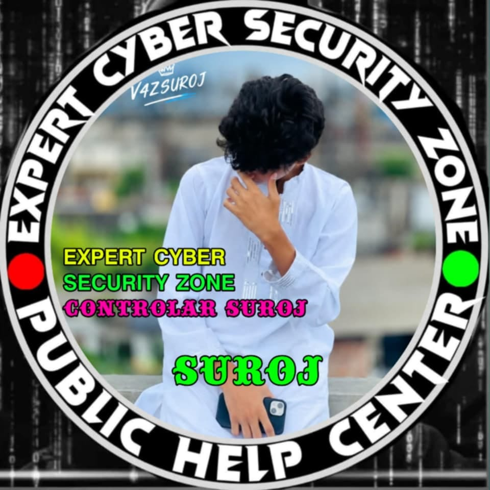
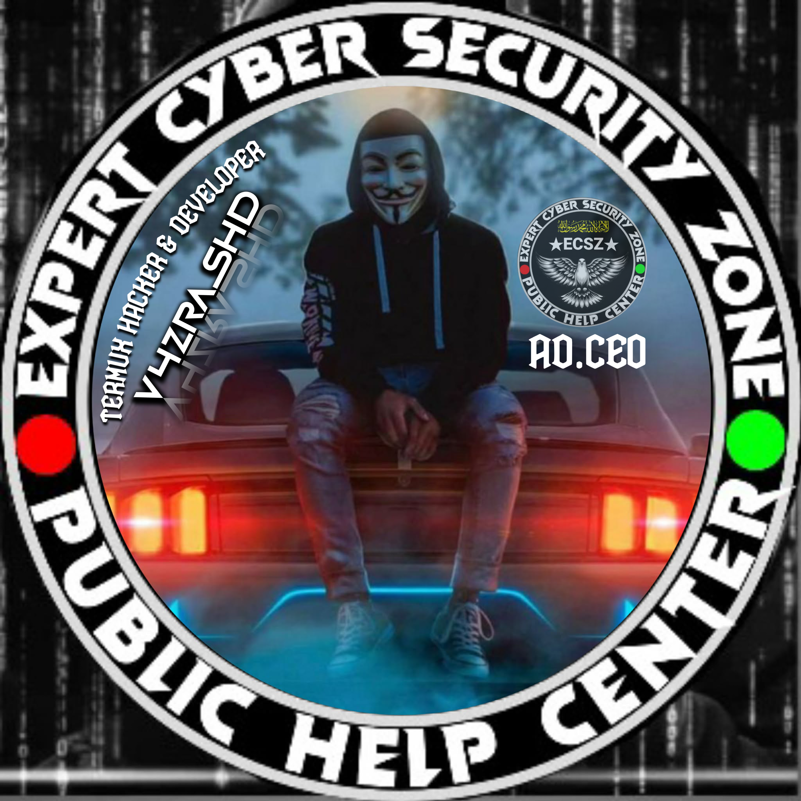
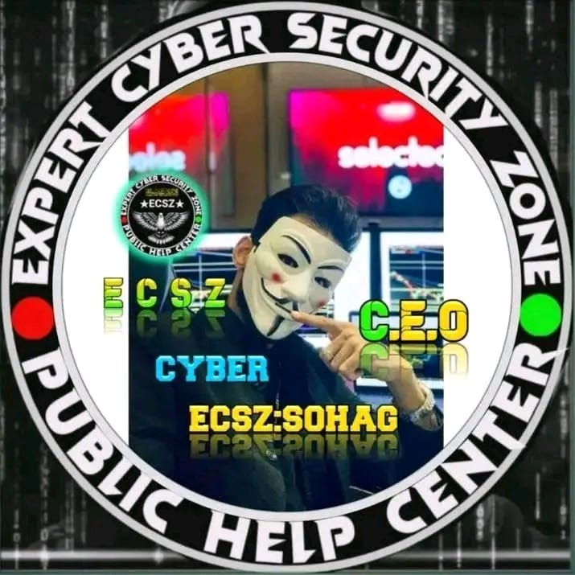

<div align="center">

<!-- ============ ANIMATED GRADIENT HERO BANNER ============ -->
<div style="width:100%; padding:18px 0; border-radius:18px; background:linear-gradient(120deg,#0b0c1e,#1a2340,#123,#0b0c1e); border:2px solid rgba(255,255,255,.08);">

<p align="center">
  
</p>

<!-- ANIMATED GRADIENT TEXT (SMIL animation, renders on GitHub) -->
<svg width="100%" height="150" viewBox="0 0 1000 150" xmlns="http://www.w3.org/2000/svg">
  <defs>
    <linearGradient id="rainbowGrad" x1="0%" y1="0%" x2="100%" y2="0%">
      <stop offset="0%"   stop-color="#00f2fe" />
      <stop offset="25%"  stop-color="#4facfe" />
      <stop offset="50%"  stop-color="#ff8a00" />
      <stop offset="75%"  stop-color="#ff2d95" />
      <stop offset="100%" stop-color="#00f2fe" />
      <animateTransform attributeName="gradientTransform" type="translate" from="0 0" to="1000 0" dur="7s" repeatCount="indefinite" />
    </linearGradient>
    <linearGradient id="bgGrad" x1="0%" y1="0%" x2="0%" y2="100%">
      <stop offset="0%" stop-color="#38f9d7" stop-opacity=".18"/>
      <stop offset="100%" stop-color="#43e97b" stop-opacity=".0"/>
    </linearGradient>
  </defs>
  <rect x="0" y="0" width="1000" height="150" rx="20" fill="#101428"/>
  <rect x="0" y="0" width="1000" height="150" rx="20" fill="url(#bgGrad)"/>
  <text x="500" y="88" text-anchor="middle" font-family="'Courier New', Courier, monospace" font-size="56" font-weight="bold" fill="url(#rainbowGrad)" letter-spacing="3">V4ZRASHD CHAT BOT</text>
  <text x="500" y="128" text-anchor="middle" font-family="'Segoe UI', Tahoma, sans-serif" font-size="24" fill="#e6f7ff" opacity=".9" letter-spacing="1">🚀 DEVELOPED BY <tspan fill="#ff8a00" font-weight="bold">RASHED (V4ZRASHD)</tspan> 🚀</text>
</svg>

</div>

<p align="center" style="margin-top:10px;">
  
</p>

<!-- ============ CONTACT BADGES ============ -->
<div align="center">
  <a href="https://github.com/v4zrashd"></a>
  <a href="https://t.me/v4zrasehd"></a>
  <a href="https://t.me/Darkbdx1"></a>
  <a href="https://www.youtube.com/@V4Zteem"></a>
  
</div>

</div>

---
<br>

<!-- ============ OWNER PHOTO GALLERY (ANIMATED FRAME) ============ -->

### 👑 Meet The Developer

<div align="center">

<!-- CSS Style for Animation -->
<style>
  .animated-img {
    border-radius: 50%;
    animation: float 3s ease-in-out infinite, glow 2s alternate infinite;
    width: 190px;
    height: 190px;
    object-fit: cover;
  }
  
  .text-gradient {
    background: linear-gradient(90deg, #00f2fe, #4facfe, #ff8a00, #ff2d95, #00f2fe);
    background-size: 300% 100%;
    -webkit-background-clip: text;
    -webkit-text-fill-color: transparent;
    animation: gradientMove 4s linear infinite;
    font-weight: bold;
    font-size: 18px;
  }

  @keyframes float {
    0% { transform: translateY(0px); }
    50% { transform: translateY(-10px); }
    100% { transform: translateY(0px); }
  }

  @keyframes glow {
    0% { box-shadow: 0 0 10px rgba(0, 242, 254, 0.5); }
    100% { box-shadow: 0 0 25px rgba(255, 45, 149, 0.8); }
  }

  @keyframes gradientMove {
    0% { background-position: 0% 50%; }
    100% { background-position: 100% 50%; }
  }
</style>

| | |
|:-:|:-:|
|  |  |
| <span class="text-gradient">ECSZ</span> | <span class="text-gradient">Controller SUROJ</span> |
|  |  |
| <span class="text-gradient">Sohag Bhai BD Facebook XCSZ</span> | <span class="text-gradient">V4ZRASHD</span> |

</div>

> ✪ **Shahadat & Sahu** are no longer the owner of this project.  
> This bot is now fully owned & maintained by **RASHED (V4ZRASHD)**.

<br>

<!-- ============ FEATURES ============ -->

## 🌟 Features

| Feature | Description |
|:--|:--|
| 🤖 **Auto Chat** | Automatic & seamless natural language conversations (AI). |
| 🖼 **Photo Editing** | Professional grade photo editing right inside Messenger. |
| 🎨 **Image Generation** | Text → Image using cutting-edge AIGC technology. |
| 🎥 **Video Downloader** | HD downloads from YouTube, Facebook, TikTok & more. |
| 🎮 **Mini Games** | 20+ fun games to play directly in the chat. |
| 😂 **Fun Commands** | Hundreds of awesome fun commands for your group. |
| 🧰 **Utility Commands** | QR, Hash, Binary, Crypto Price, System Monitor, IP lookup & more. |

<br>

<!-- ============ NEW COMMANDS ============ -->

## ✨ New Commands Added

<div align="center">

| Command | What it does |
|:--|:--|
| `qrcode <text>` | Generate a scannable QR code image. |
| `hash <text>` | MD5 / SHA1 / SHA256 / SHA512 encryption. |
| `binary` | Text ⇄ Binary converter (`t2b` / `b2t`). |
| `coin` | Coin Toss game (add letter to guess). |
| `system` | Live System Info (CPU, RAM, core, uptime). |
| `shorturl` | Shorten any long URL instantly. |
| `btc` | Live Bitcoin price (USD / BDT / INR / EUR / GBP). |
| `myip` | Get your public IP & location details. |

</div>

<br>

<!-- ============ SETUP ============ -->

## 🛠 Full Setup Guide

Follow these steps one by one to get the bot online. 🚀

### ✅ Step 1 — Requirements
- Install **Node.js** (v16 or higher) on your PC / Phone (Termux).
- A **Facebook (Messenger) account** to run the bot.
- Good internet connection. That's all!

### 📥 Step 2 — Download The Bot
```bash
git clone https://github.com/v4zrashd/V4ZRASHD-CHAT-BOT.git
cd V4ZRASHD-CHAT-BOT
```

⚙️ Step 3 — Install Dependencies

```bash
npm install
```

💡 Termux / storage permission issue? Use this instead:

```bash
npm install --no-bin-links --ignore-scripts
```

🔑 Step 4 — Add Your Facebook Session (appstate.json)

Inside the bot folder, create a file named appstate.json and paste your Facebook login cookies / appstate there.

⚠️ WARNING: Never share this file with anyone — it logs into your Facebook account!

▶️ Step 5 — Start The Bot

```bash
node v4zrashd.js
```

· The bot restarts itself automatically if it crashes.
· Dashboard runs on port 8080 (http://localhost:8080).

🔁 Bonus — Keep It Alive 24/7

· Deploy to any free host (Replit / Render / Railway) for 24/7 uptime.
· A GitHub Actions workflow (.github/workflows/) is included for testing.

<br>

<!-- ============ DEPLOYMENT ============ -->

🚀 Deployments

Platform Action
https://img.shields.io/badge/Replit-F26D00?style=for-the-badge&logo=replit&logoColor=white https://img.shields.io/badge/DEPLOY-CLICK%20HERE-blue?style=for-the-badge
https://img.shields.io/badge/Render-3FE0C5?style=for-the-badge&logo=render&logoColor=black https://img.shields.io/badge/DEPLOY-CLICK%20HERE-blue?style=for-the-badge
https://img.shields.io/badge/Railway-0B0D0E?style=for-the-badge&logo=railway&logoColor=white https://img.shields.io/badge/DEPLOY-CLICK%20HERE-blue?style=for-the-badge

<br>

<!-- ============ DEVELOPER ============ -->

👨‍💻 About The Developer

Name: 💙 RASHED (V4ZRASHD)
Profession: 💼 Chat Bot Developer & AIGC Content Creator

📞 Contact

· Telegram Channel: t.me/v4zrasehd
· Telegram: t.me/Darkbdx1
· YouTube: youtube.com/@V4Zteem
· GitHub: github.com/v4zrashd
· Facebook Page: 🚧 Coming Soon...

⚡ Approach

· 💻 Copy-paste techniques with deep customizations.
· 🤝 Collaborative development with friends.
· 🤖 AI-powered workflow using modern tools.

<br>

---

<!-- ============ SUPPORT / FOOTER ============ -->

❖ Support

Need help? Contact the admin via Telegram — we reply fast! 💬

<div align="center">
  <a href="https://t.me/v4zrasehd">
    
  </a>
  <a href="https://t.me/Darkbdx1">
    
  </a>
  <a href="https://github.com/v4zrashd/V4ZRASHD-CHAT-BOT">
    
  </a>
</div>

<p align="center">
  
</p>

<p align="center">
  
</p>

---

© 2026 V4ZRASHD — All rights reserved.

```
